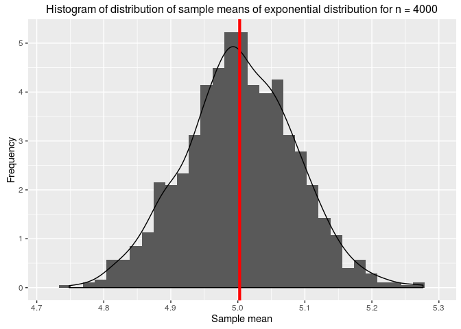
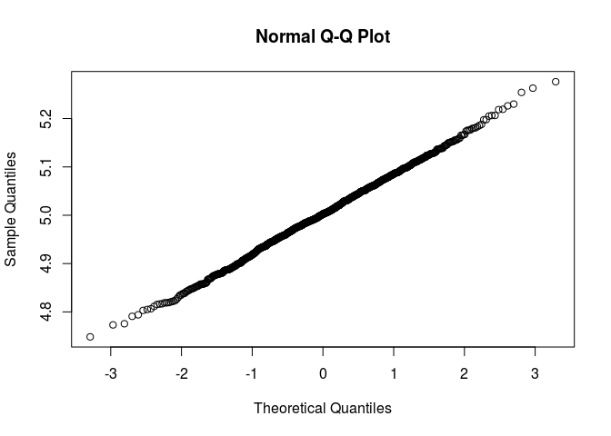

# Statistical inference course project
Przemyslaw Zientala  
24 December 2015  
##Overview

This project report is aiming to explore the [Exponential distribution]("https://en.wikipedia.org/wiki/Exponential_distribution") and the [Central Limit Theorem]("https://en.wikipedia.org/wiki/Central_limit_theorem#Central_limit_theorems_for_independent_sequences").

Via simulation and associated explanatory text the properties of the distribution of the mean of 40 exponentials will be illustrated. The following points will be addressed:

1. Show the sample mean and compare it to the theoretical mean of the distribution.
2. Show how variable the sample is (via variance) and compare it to the theoretical variance of the distribution.
3. Show that the distribution is approximately normal. For the purpose of the project, **$n$** = 40 and **$\lambda$** = 0.2, so that 
\[ 
\mu = \frac{1}{\lambda} = 0.5 
\]

##Simulations

For the purpose of reproducibility, set.seed(0) was used. The following code performs 1000 simulations of drawing 40 random numbers from the exponential distribution rexp(n, lambda) and writes the mean for each simulation to the "mu" numeric vector:


```r
#Load necessary libraries
library(ggplot2)
set.seed(0)
n <- 40
lambda <- 0.2
mu <- numeric(1000)
for (i in 1:1000){
      mu[i] <- mean(rexp(n,lambda))
}
#Mean of the distribution of averages of 40 exponentials from 1000 simulations:
mean(mu)
```

```
## [1] 4.989678
```

###Sample mean vs theoretical (population) mean

Histogram of the distribution of sample means with red line indicating the mean of the sampling distribution:


```r
mu_df <- data.frame(mu = mu)
g <- ggplot(data = mu_df, aes(x = mu))
g + geom_histogram(bins = 30, aes(y = ..density..)) + 
      geom_density() + 
      geom_vline(xintercept = mean(mu), color = "red", lwd = 1.5) + 
      xlab("Sample mean") + 
      ylab("Frequency") + 
      ggtitle(paste("Histogram of distribution of sample means of exponential distribution for n =", n)) + 
      theme(plot.title = element_text(size = rel(1.1)))
```

 

######**_Figure 1._** *Histogram of the sampling distribution of the mean*


Let's now compare the sample mean and the population mean from the exponential distribution:


```r
abs(mean(mu)-1/lambda)
```

```
## [1] 0.01032245
```

Clearly, the absolute difference between two means is very small, which is to be expected according to the Central Limit Theorem.

###Sample variance vs theoretical variance
Since $\sigma$ = $\mu$ = 5 for $\lambda$ = 0.2, $\sigma^2$ = 25 (for our exponential distribution).

Now, theoretical variance for the sampling distribution is: 

\[ 
Var = \frac{\sigma^2}{n}  = 25/40 = 0.625
\]

Variance of the sampling distribution is pretty close to the theoretical value:


```r
mu_var <- var(mu)
mu_var
```

```
## [1] 0.6181582
```

And thus standard deviation, which should be close to the theoretical value of 


```r
sqrt(25/40)
```

```
## [1] 0.7905694
```

is:


```r
sqrt(mu_var)
```

```
## [1] 0.7862304
```

It is


```r
(1/lambda)/(sqrt(mu_var))
```

```
## [1] 6.359459
```

times smaller than the theoretical standard deviation of the exponential distribution. However, this is not surprising as CLT does not state that standard deviation should approximate the theoretical standard deviation of the distribution we drew samples from.

##Is the distribution normal?
Refer back to the histogram of the sampling distribution (Fig. 1.), the curve is trying to approximate the normal distribution, although it is quite far from normal due to small $n$. Purely by visual inspection, it seems to be positively skewed. Let's confirm that:


```r
library(e1071)
skewness(mu)
```

```
## [1] 0.3461571
```

```r
shapiro.test(mu)
```

```
## 
## 	Shapiro-Wilk normality test
## 
## data:  mu
## W = 0.99137, p-value = 1.351e-05
```

Shapiro-Wilk test for normality provides evidence that the data is indeed not normally distributed. Thus, we can conclude that this sampling distribution does not approximate normal distribution well.

##Appendix - larger sample size

Let's increase $n$ to 400:


```r
set.seed(0)
n <- 4000
lambda <- 0.2
mu <- numeric(1000)
for (i in 1:1000){
      mu[i] <- mean(rexp(n,lambda))
}
#Mean of the distribution of averages of 40 exponentials from 1000 simulations:
mean(mu)
```

```
## [1] 5.002721
```

Note that now the mean is even closer to 5 than previously.

Now plot the resulting sampling distribution:

```r
mu_df <- data.frame(mu = mu)
g <- ggplot(data = mu_df, aes(x = mu))
g + geom_histogram(bins = 30, aes(y = ..density..)) + 
      geom_density() + 
      geom_vline(xintercept = mean(mu), color = "red", lwd = 1.5) + 
      xlab("Sample mean") + 
      ylab("Frequency") + 
      ggtitle(paste("Histogram of distribution of sample means of exponential distribution for n =", n)) + 
      theme(plot.title = element_text(size = rel(1.1)))
```

 

As we can see, the distribution is very close to normal now (judging by the curve shape). Let's plot the Q-Q plot of the data:


```r
qqnorm(mu)
```

 

The plot indicates that the distribution follows the normal distribution quite closely (the line's derivative/slope is mostly constant, apart from distribution's tails). Shapiro-Wilk test yields the following results:


```r
shapiro.test(mu)
```

```
## 
## 	Shapiro-Wilk normality test
## 
## data:  mu
## W = 0.99909, p-value = 0.914
```

The p-value is very close to 1, meaning that there is strong evidence against rejecting the null hyporthesis that the data is normally distributed. Thus, it follows that now, after increasing $n$ by a factor of 100, the sampling distribution approximates the normal distribution very well.
