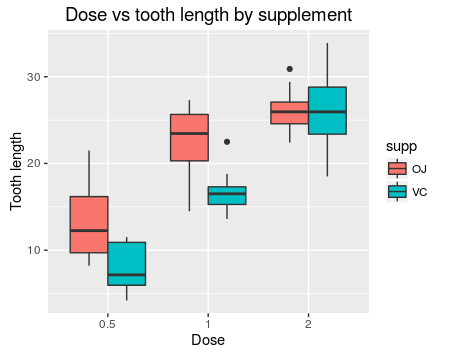

# Statistical inference course project 2
Przemyslaw Zientala  
26 December 2015  

#Overview

This project's main aim is to compare tooth growth by supplement and dose as seen in the "ToothGrowth" built-in dataset. The following points will be covered:

1. Perform some basic exploratory data analysis
2. Use confidence intervals and/or hypothesis tests to compare tooth growth by supp and dose
3 State your conclusions and the assumptions needed for your conclusions. 

#Basic exploratory analysis

Provided here is a very basic and brief exploratory analysis of the dataset.
Let's first look at the structure of the data:

```r
str(ToothGrowth)
```

```
## 'data.frame':	60 obs. of  3 variables:
##  $ len : num  4.2 11.5 7.3 5.8 6.4 10 11.2 11.2 5.2 7 ...
##  $ supp: Factor w/ 2 levels "OJ","VC": 2 2 2 2 2 2 2 2 2 2 ...
##  $ dose: num  0.5 0.5 0.5 0.5 0.5 0.5 0.5 0.5 0.5 0.5 ...
```

Everything looks good - it is a data frame with correct data type in each column for the purpose of analyses to be performed. Let's look at a boxplot of dose vs tooth length (for code see Appendix A):


Clearly, higher doses of vitamin C seem to be correlated with longer teeth, which seems intiutive. Also, note that for the first 2 doses orange juice seems to have a more pronounced effect on the length of odontoblasts (cells responsible for tooth growth).

#Hypothesis testing
For the purpose of hypothesis testing, a t-test will be used. However, this test has some underlying assumptions, of which the most important is that $X$ follows a normal distribution with mean $\mu$ and variance $\sigma^2$.

Thus, let's perform a Shapiro-Wilk test for normality

```r
shapiro.test(ToothGrowth$len)
```

```
## 
## 	Shapiro-Wilk normality test
## 
## data:  ToothGrowth$len
## W = 0.96743, p-value = 0.1091
```

The p value is ~0.11, meaning that we cannot reject the null hypothesis that data is normally distributed.

For the purpose of the t-test, let's split the data, first by delivery type:

```r
suppressMessages(library(dplyr))
vitC <- filter(ToothGrowth, supp == "VC")
juice <- filter(ToothGrowth, supp == "OJ")
```

Now, perform an unpaired t-test without an assumption of equal variances (homoscedastic t-test) and see whether the lengths of teeth are statistically different for two delivery types:

```r
t.test(juice$len, vitC$len, paired = FALSE, var.equal = FALSE, alternative = c("two.sided"))
```

```
## 
## 	Welch Two Sample t-test
## 
## data:  juice$len and vitC$len
## t = 1.9153, df = 55.309, p-value = 0.06063
## alternative hypothesis: true difference in means is not equal to 0
## 95 percent confidence interval:
##  -0.1710156  7.5710156
## sample estimates:
## mean of x mean of y 
##  20.66333  16.96333
```

The p-value is just above 0.05, meaning that, technically, the null hypothesis cannot be rejected. However, this case is quite ambiguous and arguable. Also note that the confidence interval includes 0, meaning that the true difference between means could indeed be equal to 0 (although the value of 0 is in the far right "tail" of the interval).

Now, let's check whether there is a difference in tooth growth for different doses. First, split the data:

```r
dose_0.5 <- filter(ToothGrowth, dose == 0.5)
dose_1 <- filter(ToothGrowth, dose == 1)
dose_2 <- filter(ToothGrowth, dose == 2)
```

Now perform relevant t-tests: first compare dose 0.5mg/d and dose 1mg/d with assumption of unequal variances. We assume that increasing the dose will increase the tooth growth, so one-tailed is appropriate:

```r
t.test(dose_1$len, dose_0.5$len, paired = FALSE, var.equal = FALSE, alternative = c("greater"))
```

```
## 
## 	Welch Two Sample t-test
## 
## data:  dose_1$len and dose_0.5$len
## t = 6.4766, df = 37.986, p-value = 6.342e-08
## alternative hypothesis: true difference in means is greater than 0
## 95 percent confidence interval:
##  6.753323      Inf
## sample estimates:
## mean of x mean of y 
##    19.735    10.605
```

P-value is very low, suggesting that there indeed is a difference between these doses. Let's now check dose 1mg/d and dose 2mg:

```r
t.test(dose_2$len, dose_1$len, paired = FALSE, var.equal = FALSE, alternative = c("greater"))
```

```
## 
## 	Welch Two Sample t-test
## 
## data:  dose_2$len and dose_1$len
## t = 4.9005, df = 37.101, p-value = 9.532e-06
## alternative hypothesis: true difference in means is greater than 0
## 95 percent confidence interval:
##  4.17387     Inf
## sample estimates:
## mean of x mean of y 
##    26.100    19.735
```

Once again, the test indicates that there is a difference between these doses, so, logically, there certainly is a difference between doses of 0.5mg/d and 2mg/d.

#Conclusions

To sum up, there is no statistically significant difference in tooth growth for different delivery methods, but there is a difference (positive correlation) for different doses.

#Appendix A

Boxplot code:

```r
library(ggplot2)
g <- ggplot(data = ToothGrowth, aes(x = as.factor(dose), y = len))
g + geom_boxplot(aes(fill = supp)) + ggtitle("Dose vs tooth length by supplement") + 
      xlab("Dose") + ylab("Tooth length") + theme(plot.title = element_text(size=14))
```
